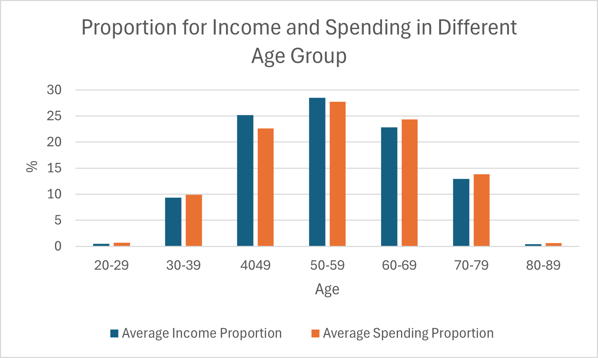

# 2 Market: Global Supermarket Sales and Demographic Analysis

## Overview
This project focuses on analysing customer demographics, sales trends, and lead conversions at **2 Market**, a global supermarket chain. The goal is to identify customer behaviour patterns across different age groups and regions to optimise marketing strategies, improve sales performance, and enhance lead conversion rates.

---

## Business Background and Key Questions
**2 Market** is a global supermarket offering a wide range of products to customers of all ages. Recent analysis identified that certain age groups, despite having high income levels, are not engaging with the products, resulting in lower sales and conversions. Additionally, sales in **Spain** outperform other regions, and understanding the reasons for this discrepancy is critical. 

### Key Questions:
- **Customer Demographics**: What factors influence the spending behaviour of different age groups, and why are certain groups underperforming despite high incomes?
- **Regional Sales Performance**: What drives the high sales and lead conversion success in **Spain** compared to other regions?
- **Lead Conversion Analysis**: How can lead conversion rates be improved for low-performing age groups?

---

## Data Cleaning and Preparation

### Steps Taken:
1. **Data Import**:
   - Imported two datasets, **marketing_data** and **ad_data**, from Excel to conduct the analysis.
  
2. **Empty Cells Check**:
   - Verified that no empty cells existed using the Excel **Find function**.

3. **Duplicate Removal**:
   - Initially, no duplicates were found based on columns like **ID**, **Year_Birth**, and **Income**.
   - Further analysis revealed **201 duplicates** when the **ID** column was excluded, and these were removed.

---

## Data Analysis Approach

### Tools Used:
- **Excel**: For data cleaning, creating formulas, and summarising findings related to income, sales, and age group analysis.
- **SQL**: For querying and analysing sales data, lead conversions, and customer demographics across different regions.
- **Tableau**: For visualisation and dashboard creation, with interactive filters to allow deeper exploration of the data.

### Key Analyses:
1. **Age Group Analysis**:
   - SQL was used to create bins for age groups and calculate total spending across different age ranges.
   - Excel was used to calculate the **average income** of each age group to compare income against spending behaviour.
   
2. **Lead Conversion**:
   - SQL was employed to join **marketing_data** and **ad_data**, and to group data by age groups, analysing the correlation between age and successful lead conversion rates.

3. **Regional Sales Performance**:
   - SQL was used to aggregate **total sales** by country, showing **Spain** as the top performer in sales and lead conversions, followed by **South Africa** and **Canada**.

---

## Key Insights and Recommendation Summary

### Key Insights:
1. **Spending vs Income Discrepancies**:
   - The **20-29** and **80-89** age groups exhibit the **highest income** but have the **lowest spending**. This discrepancy suggests inefficiencies in targeting these demographics.
  
 
   
2. **Lead Conversion Challenges**:
   - The same **20-29** and **80-89** age groups have the **lowest lead conversion rates** despite their high income, indicating that current marketing strategies are ineffective for these groups.

3. **Regional Sales Strength**:
   - **Spain** leads in both **sales** and **lead conversions**, followed by **South Africa** and **Canada**. The correlation between **sales success** and **lead conversion rates** underscores the importance of effective marketing in these regions.

### Recommendations:
1. **Targeted Marketing for Key Age Groups**:
   - Focus on the **20-29** and **80-89** age groups with tailored marketing strategies to convert high income into higher spending and lead conversions.
   
2. **Strengthen Regional Campaigns**:
   - Enhance campaigns in top-performing regions like **Spain**, **South Africa**, and **Canada** to sustain their sales and conversion success.

3. **Leverage Data Insights**:
   - Use insights from the dashboards and SQL analysis to continuously monitor customer behaviour and adapt marketing strategies for underperforming groups.
